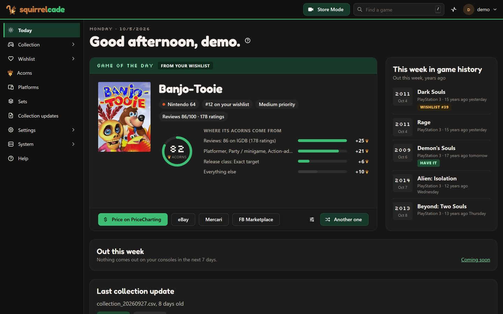

<h1 align="center"><picture><source media="(prefers-color-scheme: dark)" srcset="docs/brand/wordmark-dark.png"></picture></h1>

<p align="center"><b>Your video game collection, kept at home.</b><br>What you own, what it's worth, what's missing from each console, and what to get next.</p>

<p align="center"></p>

Squirrelcade is a free web app for video game collectors. You run it yourself, in one Docker container on a NAS (Synology, Unraid, TrueNAS...), a home server or your own computer, and use it in your browser and on your phone.

**It works on its own.** No AI, no outside account and no subscription: type your games in, and Squirrelcade builds each console's checklist from Wikipedia. Already keep your collection somewhere? Bring it in with one file from PriceCharting (values included), CLZ Games, GAMEYE, VGCollect or a spreadsheet. Everything else (covers, your PC games, messages, Claude) is optional and can be added any time.

## What it does

- **Your collection, console by console:** every copy with its condition, what you paid and what it's worth, as a list or a wall of covers, with statistics, a printable report and a spreadsheet download.
- **Every console's checklist:** what you have, what's missing and how complete you are, from Wikipedia's lists of each console's games (or a list of your own).
- **What to get next:** your Acorns wishlist ranks the games you don't have by your own rules (the consoles, genres and series you like, reviews, your own picks), with games coming soon and deals.
- **Store Mode on your phone:** scan a game's barcode in a shop and see at once whether you have it. It works with no signal.
- **Selling and trading:** a ready listing for eBay or Mercari, a record of what you sold, and trades that come out even with friends who run Squirrelcade too.
- **Sharing:** let family look without changing anything, or send a wishlist link for birthdays.
- **And more:** what you've played, loans, photos of your copies, each console's Top 100 and history, your PC games from Playnite, messages to your phone, automatic backups, and an API for other tools.

## Install it

You need a computer that's always on and runs Docker, with an Intel or AMD processor (ARM, such as a Raspberry Pi, isn't supported yet). A NAS, a mini PC or a home server is ideal.

Pick one of three ways:

1. **The step-by-step guide,** with clicks and screenshots for Synology, Unraid, TrueNAS, Portainer, any Linux server, and Windows or Mac: **[Install and set up Squirrelcade](docs/guide/README.md)**.
2. **An AI walks you through it.** Paste **[the setup prompt](docs/ai/setup-prompt.md)** into Claude, ChatGPT or another AI (a free account is enough). It asks about your computer and your collection, checks that Squirrelcade can run there, and takes you from nothing to a working Squirrelcade one step at a time. It never asks for your passwords.
3. **The short version,** if you know Docker:
   1. Make a folder, and save this in it as `docker-compose.yml` (a copy with comments: [docker-compose.example.yml](docker-compose.example.yml)):
      ```yaml
      services:
        squirrelcade:
          image: ghcr.io/squirrelcade/squirrelcade:latest
          container_name: squirrelcade
          restart: unless-stopped
          user: "1000:1000"          # a user that may write to the two folders (run `id`)
          environment:
            - TZ=America/New_York    # your time zone
          volumes:
            - ./config:/config       # database, settings, logs, backups
            - ./imports:/imports     # a watched folder for collection exports
          ports:
            - "7575:7575"
      ```
   2. Start it: `docker compose up -d`
   3. Open `http://<your server>:7575` in a browser at home, and create your account.

## The first visit

1. **Create your account.** You're the collection's owner; you can invite family as viewers later. From outside your home network, the first page also asks for a one-time **setup code**, which Squirrelcade writes in its log (`docker logs squirrelcade`), so nobody else can claim a new install.
2. **Bring your games in.** Upload an export, or use **Add a game** to type them in one at a time: pick the console, type the title, and say what you paid if you like.
3. **Let it build your checklists.** A console gets its catalog a few minutes after it has 6 different games. Then each console's page shows what you're missing, and your Acorns wishlist fills in.

[Getting started](docs/help/getting-started.md) walks through it, page by page.

## Keep it running

- **Updates:** `docker compose pull`, then `docker compose up -d`, or your NAS app's steps in [Updating later](docs/guide/install.md#updating-later). To update automatically, see [Keep it running](docs/guide/maintain.md). Squirrelcade copies its database before an update changes it, and shows what's new afterwards.
- **Backups:** Squirrelcade backs itself up every week into its config folder (**System > Backups**). Keep a copy of that folder somewhere else too: [Backups and updates](docs/help/backups.md).
- **Locked out?** Run `docker exec -it squirrelcade node server/dist/reset-link.js` on the server: it prints a link that works once to choose a new password.
- **On the internet:** if you open Squirrelcade to the internet, put a sign-in gate in front of it (a VPN such as Tailscale, or Cloudflare Access). [Sharing](docs/help/sharing.md) explains why.

## Help

Every page has a **?** that opens its guide, and **Help** in the menu has them all. They're also here: **[the help guides](docs/help/README.md)**.

## Ideas and problems

Found a problem, or have an idea? **[Open an issue](https://github.com/squirrelcade/squirrelcade/issues/new/choose)**.

Your AI can write it up for you: paste **[the request prompt](docs/ai/request-prompt.md)** into Claude, ChatGPT or another AI, and tell it what you'd like. It asks a few questions, checks what Squirrelcade does already, and gives you a link to the issue form with your request filled in. You read it, and submit it yourself (a free GitHub account is needed). Requests are reviewed, and the approved ones are built into a future version.

## Optional: ask Claude about your collection

With **Settings > Claude and AI apps** turned on, Claude can read your collection (never change it): "Which of these 30 garage-sale games do I already have?", "What's sealed on my PS3 shelf?", "What's at the top of my wishlist, and why?". On your home network, **Download the plugin** there and upload it in the Claude app (Customize > Plugins), for Cowork and Claude Code; nothing is opened to the internet. [Claude and AI apps](docs/help/ai-apps.md) has the steps and the other ways in.

## Privacy

Your collection stays on your server. Squirrelcade has no tracking of any kind and no account with anyone. It contacts Wikipedia (for catalogs), and only the services you turn on: IGDB, IsThereAnyDeal, RetroAchievements, your RomM, the ways to send you messages, and so on. When you connect Claude, the answers to its questions go to Claude; what you paid and your notes only if you allow it. [What leaves your server](docs/help/features.md#what-leaves-your-server) has the full list.

## Credits

Game data and covers come from [IGDB](https://www.igdb.com), catalogs from [Wikipedia](https://en.wikipedia.org)'s lists of video games, and values from your own [PriceCharting](https://www.pricecharting.com) export. The console histories and "why it matters" texts are drafted from Wikipedia with AI help, cite their sources, are marked as drafts until checked, and are shared under Wikipedia's license, CC BY-SA 4.0 ([apps/server/data/NOTICE.md](apps/server/data/NOTICE.md)). The Top 100 lists are a consensus of critics' and retrospective best-of lists. Squirrelcade isn't affiliated with any of them.

## License

Squirrelcade is free software under the [GNU Affero General Public License v3.0](LICENSE): you may use it, change it and share it; if you offer a changed version to others (including as a service over a network), you share its source under the same license.

## Development

Requires Node.js 22. `npm install`, then `npm test`, `npm run build` and `npm start` (the built app on port 7575, its data in `.dev-config/`). While working on the interface, run `npm run dev:server` and `npm run dev:web` (Vite on port 5175).

The code is in three packages: `packages/core` (domain logic and the settings' definitions, no I/O), `apps/server` (the API, database and tasks) and `apps/web` (the interface). [docs/PLAN.md](docs/PLAN.md) has the architecture, [docs/DECISIONS.md](docs/DECISIONS.md) the reasons behind each choice, and [CONTRIBUTING.md](CONTRIBUTING.md) how to help. Tests: `npm test` runs the unit tests; CI also installs the Docker image fresh and walks through the interface in Chrome (`scripts/smoke-test.mjs`, `scripts/ui-test.mjs`), with accessibility checks. Screenshots for the docs come only from a made-up demo collection (`scripts/demo.mjs`).
