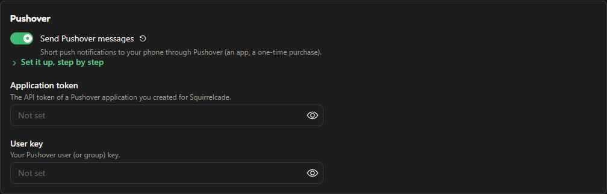
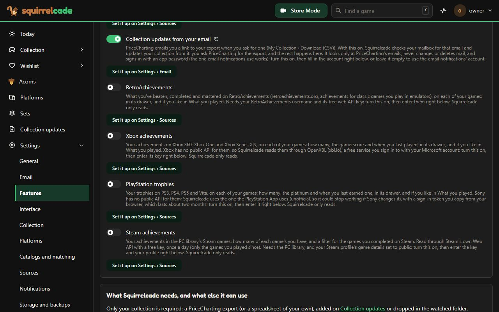

# 4. Connect what you use

Each of these is optional, and each has one home: its card on **Settings > Sources** (your email account on **Settings > Email**, messages on **Settings > Notifications**). The card has the switch, the steps (open **Set it up, step by step**), the keys it needs and a **test** button; Settings > Features has the same switches, each with a link to its card. Do them in any order, any day.

| What | What it gives you | What it needs | Time |
| --- | --- | --- | --- |
| [Covers and game details](#covers-and-game-details-igdb) | Box art, genres, series, developers; a much better wishlist | A free Twitch developer application | 5 minutes |
| [Messages](#messages) | A summary after each update, alerts, release reminders | Email, or a phone or chat app | 5 minutes |
| [Exports from your email](#exports-from-your-email) | Your collection updated by itself after you export on PriceCharting | Your mailbox's app password | 5 minutes |
| [Family and friends](#family-and-friends) | Viewers, a gift link for your wishlist, a game check without an account | Step 3 done | 10 minutes |
| [PC library](#pc-library-playnite) | Your PC games from every store, next to your console copies | Playnite on a Windows PC, a shared folder | 15 minutes |
| [PC game prices](#pc-game-prices) | Prices and lows for the PC wishlist | The PC library, a free key | 5 minutes |
| [RomM](#romm) | Links from your games to your RomM, to play them | A RomM server | 5 minutes |
| [RetroAchievements](#retroachievements) | What you beat and mastered in classic games, in each game's drawer | A free account's key | 5 minutes |
| [Xbox, PlayStation and Steam achievements](#xbox-playstation-and-steam-achievements) | Your achievements and trophies, in each game's drawer (Steam's in the PC library) | A free key, or a sign-in token (PlayStation) | 5 minutes each |
| [Barcodes](#barcodes) | Store Mode naming barcodes it hasn't seen | Nothing, or a free key | 2 minutes |
| [Selling, a goal, tests and rips](#selling-a-goal-tests-and-rips) | Listings written for eBay and Mercari, a goal, tested and ripped copies | Nothing | 5 minutes |
| [A start page or automation](#a-start-page-or-automation) | Your totals on Homepage; other tools asking what you own | The API key | 5 minutes |

Rather be walked through it? [AI-assisted setup](../help/ai-setup.md) gives a prompt, made for your Squirrelcade, for the AI you use: it asks which of these you'd like and takes you through each.

## Covers and game details (IGDB)

Free with a Twitch account: [IGDB keys](../help/features.md#igdb-keys) has the steps. **Check:** Settings > Sources > IGDB shows how many games it knows per console, and covers appear on the Stash page's grid within the hour.

## Messages

**Settings > Notifications:** each way of sending has its own switch, and shows its fields and setup steps once on. Email picks your provider (Gmail, Yahoo, iCloud...) and fills in the server; you make an **app password** at your provider (the steps link to the page). Phones: Pushover, Pushbullet, ntfy, Gotify. Chats: Discord, Telegram, Slack. For automations: a webhook (n8n, Home Assistant) or Apprise. **Check:** **Send a test message**. See [Notifications](../help/notifications.md).



## Exports from your email

PriceCharting emails a link to your export when you ask for one; Squirrelcade can pick it up from your mailbox and update your collection by itself. **Settings > Email:** fill in your email account once (your address and an app password; your provider's steps are under **Set it up, step by step**), then turn on **Stash updates from your email**. **Check:** **Test sending and reading** says how many export emails it found. Then **Settings > Collection > Reminders > Remind me to export after** 7 days sends a message with PriceCharting's page each week. See [Your collection](../help/collection.md#from-your-email).



## Family and friends

- **Viewers:** **System > Users > Invite someone** makes a link that works once; they choose their own password and can look at everything but change nothing. What you paid and your notes stay yours unless you share them (Settings > Security).
- **A gift link:** **Acorns wishlist > Share** makes a link to your top picks that anyone can open without an account (with Cloudflare Access, add the bypass in [step 3](phone.md#cloudflare-tunnel-with-cloudflare-access-a-web-address-behind-a-sign-in)).
- **"Shopping for them?"** Settings > Security > "Check a game without signing in": the sign-in page on a phone scans a game and says whether you have it, with its price.

See [Sharing your collection](../help/sharing.md).

## PC library (Playnite)

1. In [Playnite](https://playnite.link) on your Windows PC: **Settings > Backup**, and set the backup folder to a shared folder on your server (a NAS share), with automatic backups on.
2. Add that folder to the compose file, read-only, and recreate the container:

   ```yaml
       volumes:
         - /path/to/Playnite Backup:/playnite:ro
   ```

   On a Synology share only its administrators may read, add `group_add: ["101"]` (the administrators group) under the service.
3. **Settings > Features:** turn on **PC library (Playnite)** and save. In Docker, Squirrelcade looks in `/playnite` by itself (its own page, **Settings > PC library**, appears in the menu once it's on).

**Check:** **PC library** lists your games within a few minutes. See [PC library](../help/pc-library.md).

## PC game prices

Needs the PC library. A free key: sign in at [isthereanydeal.com](https://isthereanydeal.com), open its [apps page](https://isthereanydeal.com/apps/my/) and register an app. **Settings > Sources > IsThereAnyDeal (PC game prices):** paste the key, pick your store country, **Save and test**.

## RomM

In your [RomM](https://github.com/rommapp/romm): your profile > **API tokens** > a new token with the **roms.read** and **platforms.read** scopes only. **Settings > Sources > RomM (your ROM library):** RomM's address and the token, **Save and test**. See [RomM](../help/romm.md).

## RetroAchievements

On [retroachievements.org](https://retroachievements.org), signed in: **Settings**, then copy your **Web API Key** from the Keys section. **Settings > Sources > RetroAchievements:** your username and the key, **Save and test** (it says how many games you have progress in). See [What you played](../help/playing.md#retroachievements).

## Xbox, PlayStation and Steam achievements

- **Xbox:** sign in at [xbl.io](https://xbl.io) with your Microsoft account and copy the API key from its profile page. **Settings > Sources > Xbox achievements:** paste it, **Save and test**.
- **PlayStation** (unofficial): sign in at [playstation.com](https://www.playstation.com), then open [ca.account.sony.com/api/v1/ssocookie](https://ca.account.sony.com/api/v1/ssocookie) in the same browser and copy the 64 characters after npsso. **Settings > Sources > PlayStation trophies:** paste them, **Save and test**. The token lasts about two months; Squirrelcade tells you when it needs a new one.
- **Steam** (needs the PC library): a free key at [steamcommunity.com/dev/apikey](https://steamcommunity.com/dev/apikey), and your profile's game details public (Steam, your profile, Edit Profile, Privacy Settings). **Settings > Sources > Steam achievements:** the key and your profile, **Save and test**.

**Check:** each read says how many games it found; the progress shows in each game's drawer (Steam's beside each game in the PC library). See [What you played](../help/playing.md#xbox-achievements-and-playstation-trophies) and [PC library](../help/pc-library.md#steam-achievements).

## Barcodes

Store Mode names a barcode it hasn't seen by asking a barcode service: **Settings > Sources > Barcodes**. UPCitemdb needs nothing (about 100 lookups a day); [UPC Database](https://upcdatabase.org) needs a free account's key, alone or after UPCitemdb. Every name is kept for good, so each barcode is asked once.

## Selling, a goal, tests and rips

Nothing to connect, only your own numbers, in **Settings > Collection**: **Selling** (eBay's and Mercari's fees, what shipping costs you, what a meal costs, the tag of a copy you keep), **Your goal** (how many copies or games you're aiming for), and **Your copies** (the consoles whose games you rip). See [Selling your games](../help/selling.md).

## A start page or automation

**Settings > Security > API key** shows the key. [Homepage](https://gethomepage.dev)'s customapi widget can show your totals from `GET /api/v1/stats`; any tool can ask whether games are owned with `POST /api/v1/owned`. Send the key in the `X-Api-Key` header. See [the API](../API.md).
