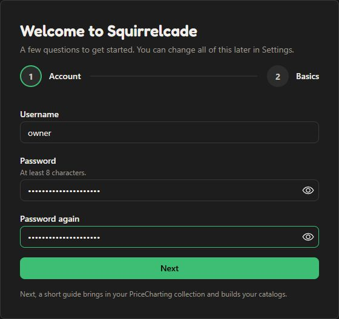
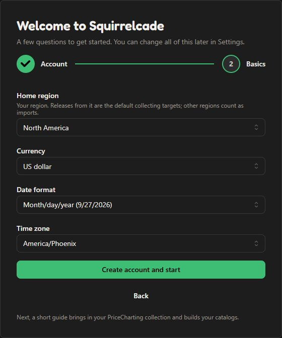
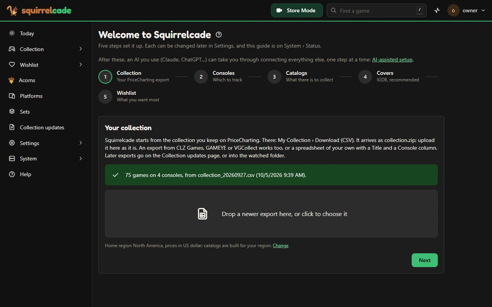
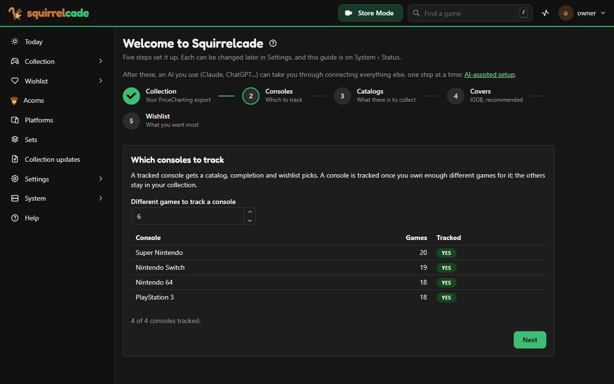
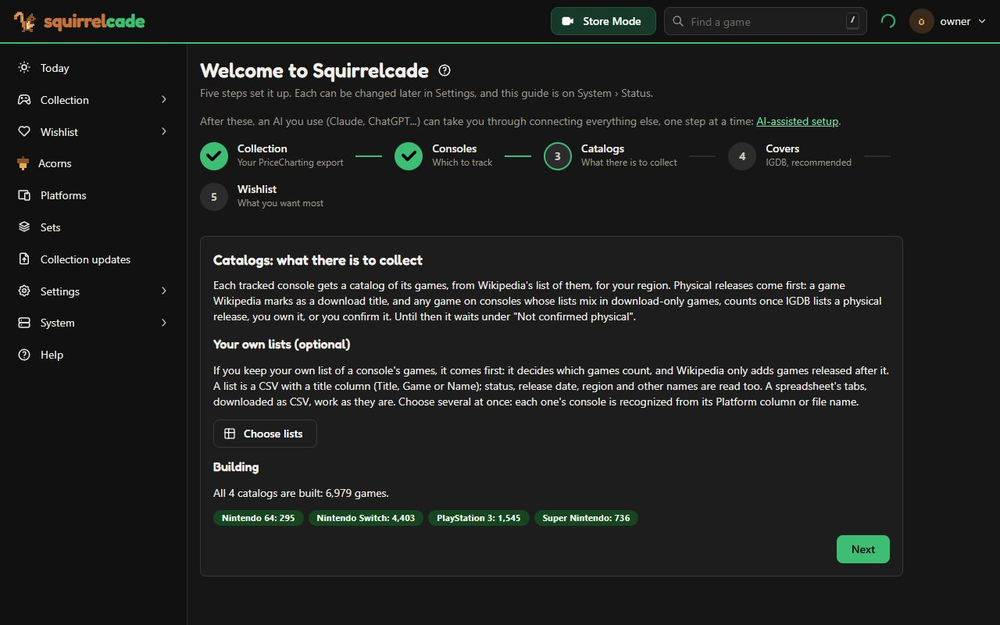
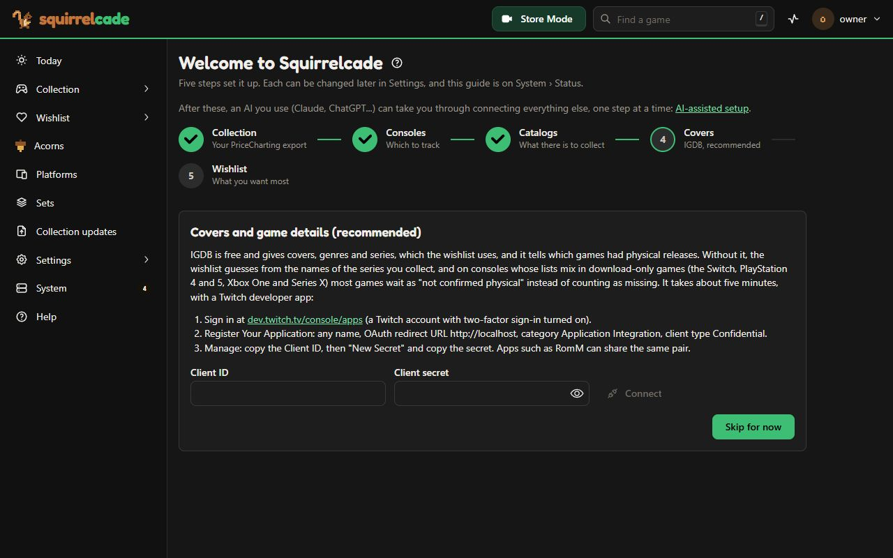
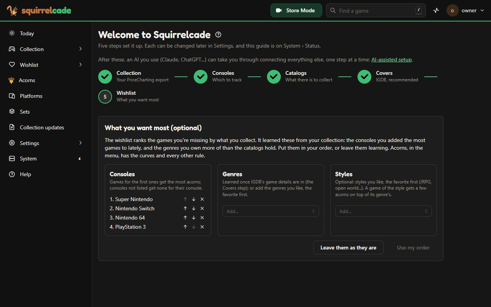
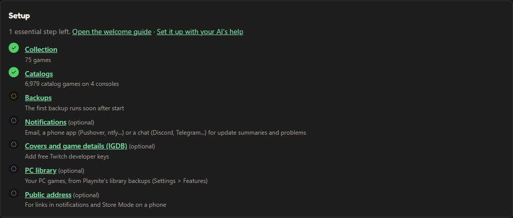

# 2. The first visit

Open Squirrelcade's address in a browser on a computer at home. Not sure what it is? See [Check that it worked](install.md#check-that-it-worked).

## Your account

The first page makes the **owner's account**, the one that owns the collection:

1. Type a **Username** and a **Password** (at least 8 characters; a few words together is easy to remember), and the password again in **Password again**. Opening Squirrelcade from outside your home network? The page then starts with a **Setup code** box: the code is in Squirrelcade's log, on the line that begins "No account yet" (see [Check that it worked](install.md#check-that-it-worked)).
2. Click **Next**. Pick your **Home region** (it fills in the usual currency and date format), your **Currency** (values are shown in it; Squirrelcade doesn't convert them), your **Date format** and your **Time zone**.
3. Click **Create account and start**.

All of these can change later in **Settings > General**.

 

## Your collection

The **welcome guide** starts right after. Its first step brings your games in, whichever way suits you (only the first needs an account somewhere):

- **From PriceCharting** (if you keep your collection there): **My Collection > Download (CSV)**. PriceCharting emails you a link; the file is `collection.zip`. Drop the zip into the welcome guide as it is (or the CSV inside it). Keep its name if you unzip it (`collection_YYYYMMDD.csv`): its date is the date of the prices. It brings each copy's value (a spreadsheet of your own can too, with a Value column).
- **From another app or a spreadsheet:** an export from CLZ Games, GAMEYE or VGCollect, or a spreadsheet of your own saved as CSV with a **Title** and a **Console** column: see [a spreadsheet of your own](../help/collection.md#a-spreadsheet-of-your-own-instead).
- **By hand:** **Add games one at a time** opens **Add a game** (also in the menu, under **Acorns**). Pick the console, type the title, and say what you paid if you like. When you're done, **Back to the welcome guide** at the top of the page takes you to the next step. (Later, **System > Status > Open the welcome guide** brings it back.)

An export shows what Squirrelcade found in it: how many games on which consoles, and anything it couldn't read. **Next** works once at least one game is in.

## Consoles and catalogs

- **Consoles:** a console gets a **catalog** (the list of its games, to see what you're missing) once you own a few different games for it: 6 by default (Settings > Platforms). Typing your games in by hand? Until a console has its catalog, Add a game suggests only the games you've added to it. Set that number to 1 for a catalog after the first game.
- **Catalogs:** Squirrelcade builds each one from Wikipedia's list of the console's games, physical releases first. It takes a few minutes the first time (Wikipedia is asked politely, one page at a time); the **activity** icon at the top shows the work going on. If you keep your own list of a console's games, you can use it instead (a console's page > "Where this catalog comes from").

## The optional steps

- **Covers:** free IGDB keys give covers, genres and series, and make the wishlist much better. It takes 5 minutes: see [IGDB keys](../help/features.md#igdb-keys). You can do it later.
- **Wishlist:** put the consoles and genres you like in your own order. Squirrelcade suggests an order from what you collected lately.

## Check that it worked

**System > Status** has a **setup checklist**: what's done, what's left, each with a link to where it's done. Until the essential steps are done, it's also at the top of **Today**.

- **Almanac > Platforms** lists your consoles with their completion (for example "PlayStation 3: 312 of 1,847").
- **Collection** lists your copies, with their value from a PriceCharting export (or none, for games added by hand).
- **System > Review** may have questions: titles that look alike ("Doraemon 2" and "Doraemon 2: Nobita no Toys Land Daibouken"). Answer a few; each answer counts everywhere. [How matching works](../MATCHING.md) explains when a copy counts.

Numbers that look wrong? Open a console's page, then a game you own that shows as missing: its drawer says what the catalog has and why the copy didn't count.

Next: [reach it from your phone](phone.md), for Store Mode in a store. Or let an AI you use take you through the rest (your phone, covers, messages, the services you use), one step at a time: the welcome guide links to [AI-assisted setup](../help/ai-setup.md).
