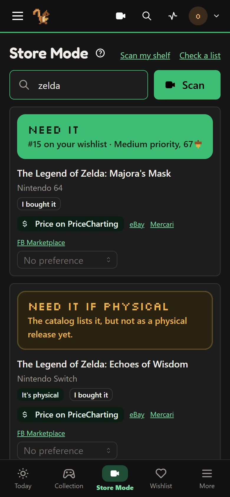

# 3. Reach it from your phone

At home, your phone reaches Squirrelcade the same way a computer does (`http://<your server>:7575`), and Store Mode works by typing titles. Two things need more:

- **The barcode camera** works only over **HTTPS** (an address starting with `https://` and a certificate): browsers don't allow the camera on plain `http://`.
- **Away from home** (in a store), your phone has to reach your server over the internet, safely.

Three good ways, from simplest to most flexible. Pick one.

## Tailscale (private, the simplest)

[Tailscale](https://tailscale.com) makes a private network of your own devices; nothing is opened to the internet. Free for personal use.

1. Make a Tailscale account, install Tailscale on your server (Synology, Unraid and TrueNAS have it as an app or package) and on your phone, and sign in on both.
2. In Tailscale's admin console, **DNS**: turn on **MagicDNS** and **HTTPS Certificates**.
3. On the server: `tailscale serve --bg 7575`. Squirrelcade is then at `https://<server name>.<your tailnet>.ts.net`, with a certificate, from any of your devices.

Anyone else (family checking a game for you) needs Tailscale too, on your network: fine for a household, less so for grandparents. For them, see Cloudflare below.

## Cloudflare Tunnel with Cloudflare Access (a web address, behind a sign-in)

Needs a domain of your own on Cloudflare (a few dollars a year) and a free Cloudflare account.

1. Cloudflare's dashboard > **Zero Trust > Networks > Tunnels > Create a tunnel** (Cloudflared). Run the connector it shows on your server (a Docker container is easiest).
2. Add a **public hostname** (`squirrelcade.your-domain.com`) pointing at `http://<your server>:7575`.
3. **Zero Trust > Access > Applications > Add:** a self-hosted application for that hostname, with a policy allowing your email address (and family's). Cloudflare then asks for an emailed code before anyone reaches Squirrelcade; Squirrelcade's own sign-in comes after.
4. In Squirrelcade, **Settings > Security > Trusted proxies** (Show advanced): the address the tunnel's connector reaches Squirrelcade from (for a connector in Docker, its network's gateway, such as `172.18.0.1`), so Squirrelcade sees each visitor's real address. Restart Squirrelcade after saving.

**Share links** (your wishlist for gifts) must open for anyone: add a second Access policy with the action **Bypass** for the paths `/share/*` and `/api/v1/share/*` only. See [Sharing your collection](../help/sharing.md).

## A reverse proxy with a certificate

If you already run one (Nginx Proxy Manager, Caddy, Traefik, or Synology's **Login Portal > Advanced > Reverse Proxy** with a Let's Encrypt certificate), add Squirrelcade to it: `https://squirrelcade.your-domain.com` to `http://<your server>:7575`, and add the proxy's address to **Settings > Security > Trusted proxies**.

Don't open Squirrelcade to the whole internet without a gate in front (a VPN, Cloudflare Access, or your proxy's own sign-in): its sign-in page is built for a household, not for the whole internet's attempts.

## On the phone

- Open the HTTPS address and sign in. **Add to Home Screen** (Safari's share menu, or Chrome's menu) gives Squirrelcade an icon like an app.
- The **camera button** at the top of every page opens Store Mode with the camera on. The first time, allow the camera.
- Open Store Mode once while you're connected: it keeps a copy of its answers on the phone, and Squirrelcade then opens even in a store without signal (with the tab closed too).

## Check that it worked

On your phone, away from Wi-Fi: open the address, tap the camera button, and scan a game you own. It should say **You own this**. The camera doesn't start? The address must start with `https://`; a phone setting may also block the camera for the browser (iPhone: Settings > Safari > Camera).
